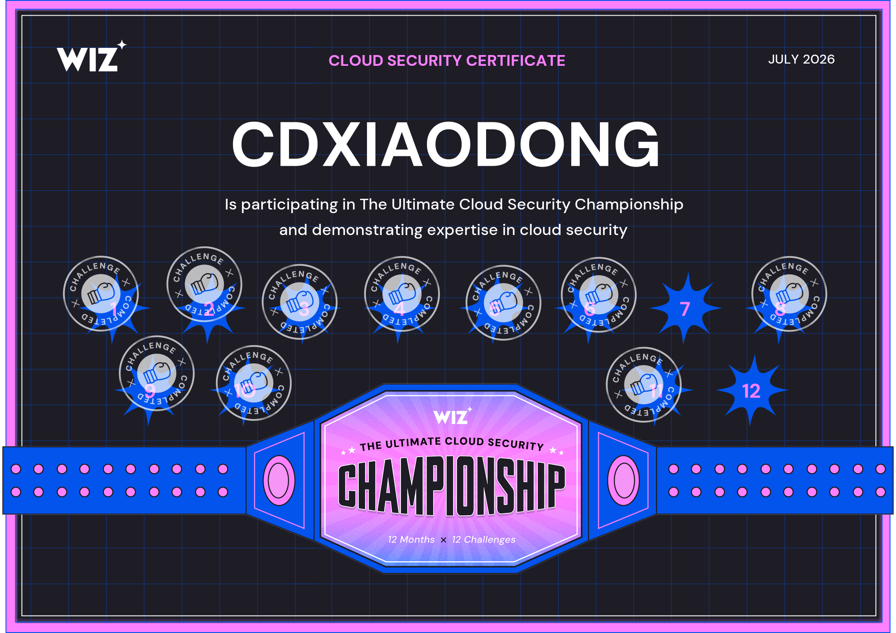

<h1 align="center">Hi, I'm CDxiaodong</h1>

  <strong>Agentic AI · AI Agent Security · LLM Engineering · Security Automation</strong>

  

  
  
  
  

  
  
  
  

---

## 👨‍💻 About Me

I am an AI Agent security researcher and engineer working across runtime guardrails, agent evaluation, LLM post-training, cloud-native security, and enterprise automation. I build systems from requirements discovery and prototype design through engineering, evaluation, iteration, and delivery -- not just demos.

我是一名偏工程落地的 AI Agent 安全研究与开发人员，长期在 AI、安全、全栈和自动化的交叉区域工作，能够把模糊需求转化为可验证 PoC、可部署 Agent 工作流和可复用评测体系。

| 📊 Evidence | 🚀 Scope |
| --- | --- |
| **3,000+** evaluation records | Agent and AI-security benchmark engineering |
| **9** core metrics | Model selection, architecture comparison, and regression evaluation |
| **14** OpenClaw security PRs | **11** vulnerability classes across trust boundaries and runtime behavior |
| **100+** AI workflows | Automation, data processing, security operations, and knowledge work |
| **1 granted patent** | Cloud-security validation methodology |

## 🏆 Rank & GitHub Activity

  <a href="https://ghfind.com/u/cdxiaodong?ref=badge">
    <picture>
      <source media="(prefers-color-scheme: dark)" srcset="https://ghfind.com/api/card/mini/cdxiaodong?theme=dark&lang=zh" />
      
    </picture>
  </a>

  

  
  

  
  

## 🧰 AI & Engineering Toolkit

  

| Layer | Tools and methods |
| --- | --- |
| 🤖 **Agentic AI** |       |
| 🧠 **Model Engineering** |       |
| 📐 **Evaluation & Retrieval** |       |
| ⚙️ **Inference & Delivery** |       |
| 🛡️ **Security Engineering** |       |

## 🎯 Current Focus

- **Secure Agent Systems** -- scope enforcement, permission boundaries, tool-call review, human approval, audit trails, and deterministic safety controls.
- **Agent Evaluation** -- reproducible benchmarks, long-horizon task analysis, LLM-as-Judge, regression testing, token/cost tracking, and failure attribution.
- **LLM Post-training** -- SFT, LoRA/QLoRA, DPO, GRPO, trajectory distillation, code-gym RL, reward design, and reward-hacking defenses.
- **Enterprise AI Delivery** -- Agent workflows for security operations, document intelligence, business analysis, API integration, and private-model deployment.

## 🚀 Featured Projects

| Project | What it demonstrates |
| --- | --- |
| 🤖 [**cain-agent**](https://github.com/cdxiaodong/cain-agent)  | Real-world AI security-testing agent for authorized assessments. Deterministic orchestration, scope enforcement, read-only toolchain, separate finder/validator sessions, evidence pipelines, and six-cloud coverage. |
| 🛡️ [**dsh-guardian**](https://github.com/cdxiaodong/dsh-guardian) | Runtime guardrail for tool-using agents. Covers prompt injection, tool poisoning, secret leakage, SSRF, dangerous commands, path sandboxing, risk scoring, and human approval. |
| 🖥️ [**AionUi**](https://github.com/iOfficeAI/AionUi)  | Core open-source contribution to a 24/7 cowork application supporting Claude Code, Codex, OpenCode, OpenClaw, Hermes, and other CLI agents. |
| 🏝️ [**dsh-island**](https://github.com/cdxiaodong/dsh-island) | Bridges DeepSeek Harness agent state, tools, and approval events to the CodeIsland macOS Dynamic Island interface. |
| ☁️ [**Cloud_Unauthorized_Tool**](https://github.com/cdxiaodong/Cloud_Unauthorized_Tool)  | Go-based cloud exposure and unauthorized-access validation tooling for controlled security assessments. |
| 🔌 [**cloud_native_mcp**](https://github.com/cdxiaodong/cloud_native_mcp) | MCP-based multi-cloud security integration covering AWS, Azure, GCP, Alibaba Cloud, Tencent Cloud, and Huawei Cloud. |

> Security projects are intended for authorized testing, defensive research, and environments where the operator has explicit permission.

## 🔬 AI Security Research

- Audited **OpenClaw** security boundaries and submitted **14 security PRs**, covering 11 vulnerability classes including SSRF, token exposure, path traversal, prototype pollution, environment-variable injection/RCE, and Windows junction escape.
- Research coding-agent trust boundaries across **Claude Code, Codex, OpenCode, Gemini CLI, OpenClaw, and AI-integrated browsers**, with responsible disclosures through Anthropic VDP, Google Bug Hunters, and GitHub Security Advisories.
- Contributed security advisories including `GHSA-g5hv-4fwh-h87r` and `GHSA-wqv3-rc3w-52r6`.
- Built benchmark tooling around multi-step reasoning, agent architecture, tool-use reliability, validation quality, and operational efficiency.
- Previous research spans cloud/container security, BAS/AEV, RASP, endpoint/runtime security, Java code auditing, and responsible CNVD/CNNVD disclosure.

## 🥇 Security Challenge Gallery

| EKS Cluster Game | K8s Lan Party |
| :---: | :---: |
|  |  |

| Cloud Hunter | Wiz Perimeter Leak |
| :---: | :---: |
|  |  |

| AI Security Challenge | Split Horizon |
| :---: | :---: |
|  |  |

## 🌐 Open-source Contributions

- **AionUi** -- core contributor across agent experience and product engineering.
- **Claude Agent SDK** -- contributor and application builder.
- **WiseFlow / Xiaobei, n8n, Fscan, Apt_t00ls, JarEditor, Memexec, Deadpool, and KubeAPI-Inspector** -- code, integration, documentation, or usability contributions.
- Active work across Agent runtime protection, DeepSeek Harness plugins, cloud-security tooling, and developer automation.

## ✍️ Selected Writing

- [OpenClaw 17个漏洞攻击面：发布此文时只修复一个](https://cdxiaodong.life/article/3230f0c5-b87c-80c6-b3ca-e3ac510aa3cd)
- [工具调用的信任困境：AI 编程智能体是如何沦为“盲从执行者”的](https://cdxiaodong.life/article/31a0f0c5-b87c-80d4-8c44-d29040794e9b)
- [Claude Code v2.1.71 -- 完整架构分析报告](https://cdxiaodong.life/article/31d0f0c5-b87c-8043-84a2-d47565f6f9e5)
- [从“灰产数据”到“数据供应链”：我对 Codex 污染问题的四轮追溯](https://cdxiaodong.life/article/3060f0c5-b87c-80c2-b91a-d531f9cb294b)
- [智·战 2025 -- 腾讯云鼎 AI 安全测试大赛全景复盘](https://cdxiaodong.life/article/2ba0f0c5-b87c-8060-92c5-e37f04442bc5)
- [AI Agent 中浮点计算导致结果不一致：成因、影响与优化策略](https://cdxiaodong.life/article/27c0f0c5-b87c-80f0-8eb0-e624f409b8d5)
- [RASP Attack and Defence](https://cdxiaodong.life/article/RASP-Attack_and_Defence)

Read all articles at **[cdxiaodong.life](https://cdxiaodong.life)**.

## 📈 Contribution Landscape

<picture>
  <source media="(prefers-color-scheme: dark)" srcset="profile-3d-contrib/profile-night-rainbow.svg" />
  
</picture>

## 🗂️ Earlier Work

<strong>Security tools, PoCs, and systems archive</strong>

### Cloud and container security

- [ebpf-c-tample-action](https://github.com/cdxiaodong/ebpf-c-tample-action)
- [k8s-2024-21626](https://github.com/cdxiaodong/k8s-2024-21626)
- [docker-for-Verification](https://github.com/cdxiaodong/docker-for-Verification)
- [CVE-2024-21626](https://github.com/cdxiaodong/CVE-2024-21626)
- [CVE-2021-4034-touch](https://github.com/cdxiaodong/CVE-2021-4034-touch)
- 20 container-security CVE images and validation environments

### Runtime, binary, and authorized red-team research

- [ASM-hide-RASP](https://github.com/cdxiaodong/ASM-hide-RASP)
- [Transacted-Hollowing-allinone](https://github.com/cdxiaodong/Transacted-Hollowing-allinone)
- [Audio Reverse Shell](https://github.com/cdxiaodong/audio-reverse-shell)
- [AVkiller](https://github.com/cdxiaodong/AVkiller)
- [Packer](https://github.com/cdxiaodong/packer)
- [CS](https://github.com/cdxiaodong/cs)
- [STEAL-HOOK](https://github.com/cdxiaodong/STEAL-HOOK)
- [Binary Utility Functions](https://github.com/cdxiaodong/some-function-in-binary)
- `NCuploadServletRCE` -- historical repository, no longer publicly available
- [Apt_t00ls fork](https://github.com/cdxiaodong/Apt_t00ls)
- [selenium-nps](https://github.com/cdxiaodong/-selenium-nps-)
- [shell research](https://github.com/cdxiaodong/-shell-)

### Development and productivity

- [Site-Specific Extension Manager](https://github.com/cdxiaodong/Site-Specific-Extension-Manager)
- [Windows Internals 7th Chinese notes](https://github.com/cdxiaodong/windows-internals-7th-Chinese-)
- [Docker notes](https://github.com/cdxiaodong/-Docker-)

<strong>SaaS and interactive projects</strong>

- [Cloud-Native ATT&CK Matrix](https://cloud-matrix.cdxiaodong.life/) -- multi-dimensional view of cloud attack techniques.
- [Top 7 Cloud Attack Paths](https://top-7-attack-paths.cdxiaodong.life/) -- interactive cloud-security attack-path reference.
- [Favorite Articles Real-Time](https://favorite-article.cdxiaodong.life/) -- continuously updated reading and research collection.

<strong>Complete legacy profile and writing archive</strong>

The previous README, including every historical project and article link, is preserved verbatim in [archive/README-legacy-2026-08-27.md](archive/README-legacy-2026-08-27.md).

---

  <a href="https://github.com/cdxiaodong?tab=repositories">Repositories</a> ·
  <a href="https://github.com/pulls?q=is%3Apr+author%3Acdxiaodong">Pull Requests</a> ·
  <a href="https://cdxiaodong.life">Blog</a> ·
  <a href="mailto:cdxiaodong@systemshell.org">Email</a>

  

