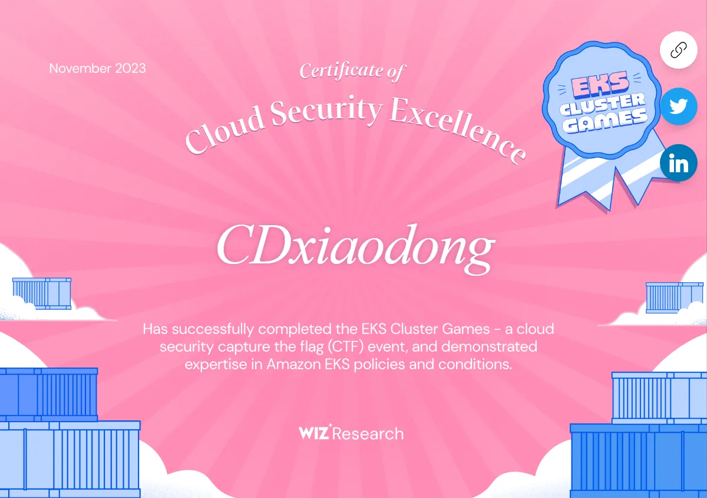
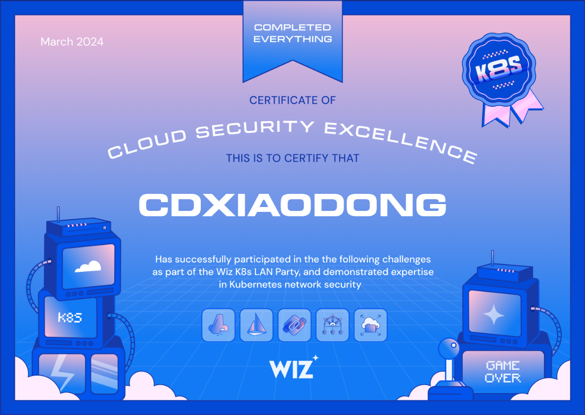
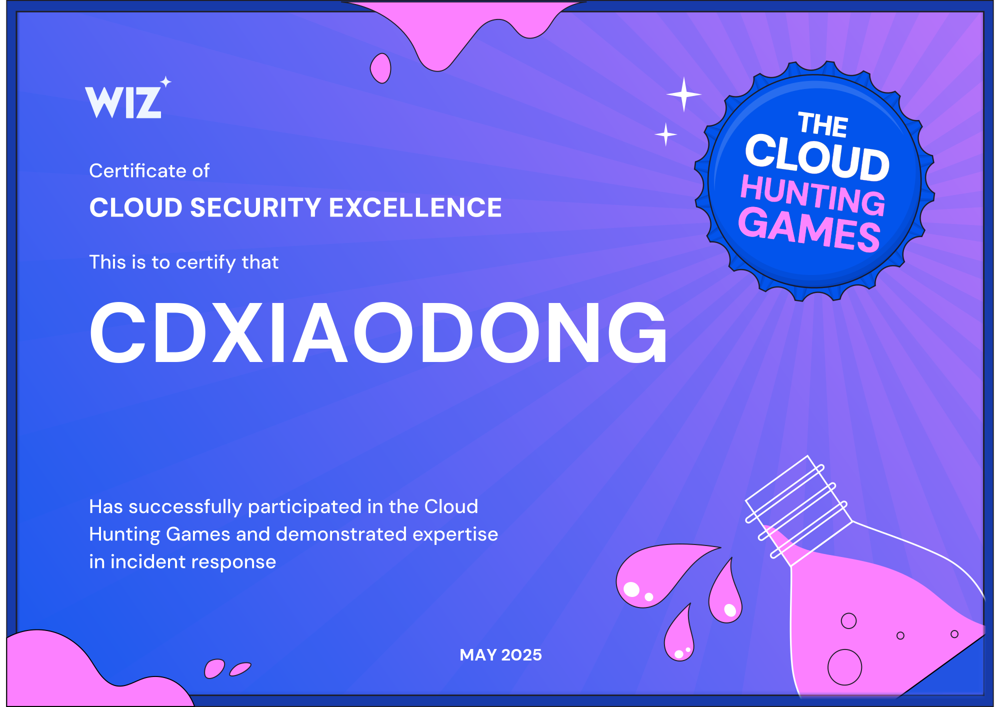
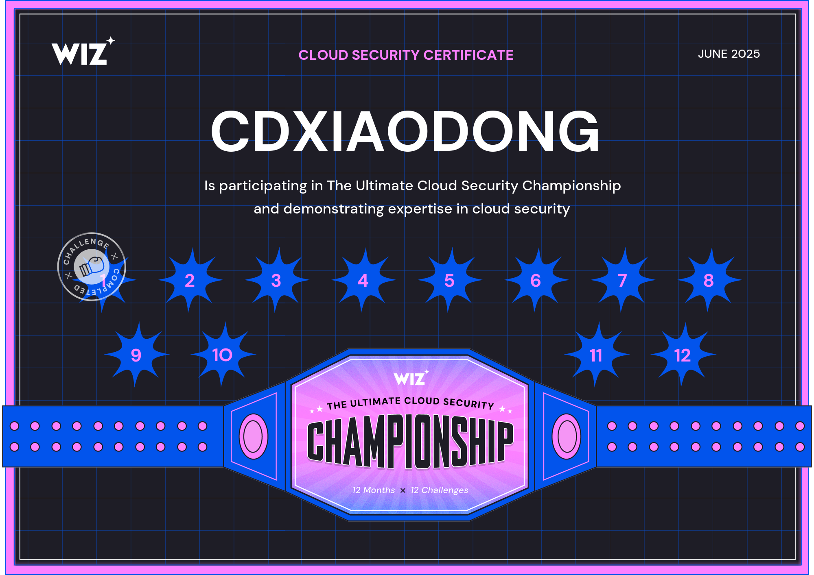
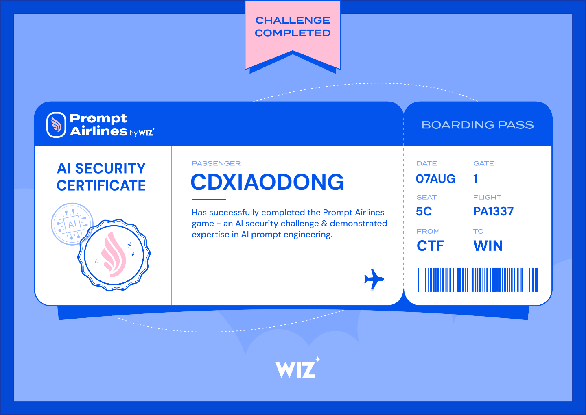

<!--   my-icons -->

    
    
       

<!--   my-ticker -->    

<!--   my-kaggle     
### My achievements on [kaggle]():

-->

## 🛠️ My Skills & Expertise

| **Category** | **Details** |
|--------------|-------------|
| **Doing** |     |
| **Languages / IDE** |       |
| **Domain Knowledge** |     |
| **CI / CD** |    |
| **ML / DL Frameworks** |     |

| **EKSClusterGame** | **K8s-Lan-Party** |
|:------------------:|:-----------------:|
|  |  |
| [View on GitHub](https://github.com/user-attachments/assets/5a7473db-2cf9-44ed-b4cb-9d02a81d90af) | [View on GitHub](https://github.com/user-attachments/assets/71677437-6689-413c-81c8-7736a60737bf) |

| **CloudHunterGame** | **Wiz-Perimeter-Leak** |
|:------------------:|:-----------------:|
|  |  |
| [View on GitHub](https://github.com/user-attachments/assets/5a7473db-2cf9-44ed-b4cb-9d02a81d90af) | | [View on GitHub](https://github.com/user-attachments/assets/71677437-6689-413c-81c8-7736a60737bf) |

| **AI Security Challenge** | **Contain Me If You Can** |
|:------------------:|:-----------------:|
|  |  |
| [View on GitHub](https://github.com/user-attachments/assets/5a7473db-2cf9-44ed-b4cb-9d02a81d90af) | | [View on GitHub](https://github.com/user-attachments/assets/71677437-6689-413c-81c8-7736a60737bf) |

**Focus**: Committed to advancing research in **cloud security** and **container security**. **Dream** to join **Wiz**

## 🔍 Vulnerabilities & Security Research

| **Category** | **Details** |
|--------------|-------------|
| **CNVD** | CNVD-C-2022-369640, CNVD-2022-498774, CNVD-2022-51701, CNVD-C-2023-73489 |
| **CNNVD** | CNNVD-2023/2024 and over a dozen contributions |
| **Focus** | - Secured multiple CNNVD certificates on domestic platforms - Exploring international CVE platforms for future contributions - Active research in **cloud security** SRC |

## 🚀 Projects I've Contributed To

- [**WiseFlow**](https://github.com/TeamWiseFlow/wiseflow) - AI-powered security search platform    
- [**Apt_t00ls**](https://github.com/White-hua/Apt_t00ls) - Zero-day exploit toolkit     
- [**JarEditor**](https://github.com/Liubsyy/JarEditor) - Fluent Java archive editing tool    
- [**Memexec**](https://github.com/hackerschoice/memexec) - Bypasses "noexec" mount flag for arbitrary Linux binary execution via ptrace-less process injection  
- [**Fscan**](https://github.com/shadow1ng/fscan) -  Add port exclusion during scanning to bypass port honeypots 
- [**Deadpool**](https://github.com/thinkoaa/Deadpool) - Optimize user experience  
- [**KubeAPI-Inspector**](https://github.com/yeahx/KubeAPI-Inspector) - Add skip-tls-verify  
  

##  💻I'm also write some codes ;)
red-team:
- https://github.com/cdxiaodong/-selenium-nps-
- https://github.com/cdxiaodong/-shell-
- https://github.com/cdxiaodong/NCuploadServletRCE
- https://github.com/cdxiaodong/Apt_t00ls
- https://github.com/cdxiaodong/Transacted-Hollowing-allinone
- https://github.com/cdxiaodong/ASM-hide-RASP

cloud-sercurity:
- https://github.com/cdxiaodong/ebpf-c-tample-action
- https://github.com/cdxiaodong/k8s-2024-21626
- https://github.com/cdxiaodong/docker-for-Verification

chrome plugin:
- https://github.com/cdxiaodong/Site-Specific-Extension-Manager
  
office efficiency :
- https://github.com/cdxiaodong/windows-internals-7th-Chinese-
- https://github.com/cdxiaodong/-Docker-

### - POC Based
- https://github.com/cdxiaodong/CVE-2021-4034-touch
- https://github.com/cdxiaodong/CVE-2024-21626
- 20 container secure CVE images

## 📝 Articles You Don’t Want to Miss

*Some articles are password-protected. Contact me for access!*

### 🎣 Phishing Techniques
- [**Phishing Techniques Report - CD**](https://cdxiaodong.github.io/%E9%92%93%E9%B1%BC%E6%89%8B%E6%B3%95%E6%8A%A5%E5%91%8A-CD.html) - Insights into modern phishing strategies

### 🌐 Web Penetration & Code Audit
- [**Java Code Audit Getting Started**](https://cdxiaodong.github.io/java%E4%BB%A3%E7%A0%81%E5%AE%A1%E8%AE%A1%E5%85%A5%E9%97%A8.html) - Beginner’s guide to Java code auditing
- [**MingYuan Cloud**](https://cdxiaodong.github.io/%E6%98%8E%E6%BA%90%E4%BA%91.html) - Security analysis of MingYuan Cloud *(Password-protected)*
- [**Java Code Audit Quick Tips**](https://cdxiaodong.github.io/java%E4%BB%A3%E7%A0%81%E5%AE%A1%E8%AE%A1%E5%B0%8Ftips.html) - Practical tips for efficient auditing
- [**Exploiting Java Deserialization with NC**](https://cdxiaodong.github.io/ysos%E5%88%A9%E7%94%A8nc%E5%8F%8D%E5%BA%8F%E5%88%97%E5%8C%96.html) - Deserialization exploit techniques
- [**Java Code Audit: Rapid RCE Exploration**](https://cdxiaodong.github.io/java%E4%BB%A3%E7%A0%81%E5%AE%A1%E8%AE%A1-rce%E7%AC%AC%E4%B8%80%E6%AD%A5-%E5%BF%AB%E9%80%9F4%E5%B1%82%E6%8E%A2%E7%B4%A2%E6%9C%AA%E6%8E%88%E6%9D%83.html) - 4-step guide to finding RCE vulnerabilities
- [**Parallel Batch Exploiting Java RCE**](https://cdxiaodong.github.io/java%E5%BF%AB%E9%80%9Frce%E4%B9%8B%E6%89%B9%E9%87%8F%E5%8F%8D%E7%BC%96%E8%AF%91%E5%90%8E%E4%B9%8B%E4%B8%89%E7%BA%BF%E5%B9%B6%E8%A1%8C(%E4%BD%BF%E6%95%88%E7%8E%87%E6%8B%89%E6%BB%A1)%E6%89%BE%E6%B4%9E.html) - Maximizing efficiency in RCE exploitation
- [**Java Vulnerabilities Overview**](https://cdxiaodong.life/article/17-java-vluns) - Common Java security issues
- [**Java 9 Self-Attach Techniques**](https://cdxiaodong.life/article/java9-self-attch) - Advanced Java debugging methods

### 🖧 AD & Intranet Penetration
- [**From External to Domain Controller via Weblogic**](https://cdxiaodong.github.io/%E4%BB%8E%E5%A4%96%E7%BD%91%20Weblogic%20%E6%89%93%E8%BF%9B%E5%86%85%E7%BD%91%EF%BC%8C%E5%86%8D%E5%88%B0%E7%BA%A6%E6%9D%9F%E5%A7%94%E6%B4%BE%E6%8E%A5%E7%AE%A1%E5%9F%9F%E6%8E%A7205359.html) - Full penetration path to domain control *(Password-protected)*

### 💻 Programming & Development Notes
- [**PHP WebShell: Basics to Advanced**](https://cdxiaodong.github.io/phpwebshell%E4%BB%8E%E5%9F%BA%E7%A1%80%E5%88%B0%E6%B7%B1%E5%85%A5%E5%8F%98%E7%A7%8D.html) - Evolution of PHP WebShell techniques
- [**Disabling Windows Defender with Turated**](https://cdxiaodong.github.io/turated%E5%85%B3%E6%8E%89windowsdefance.html) - Bypassing Defender for testing
- [**Building a Twitter Crawler**](https://cdxiaodong.github.io/%E5%88%B6%E4%BD%9Ctwitter%E7%88%AC%E8%99%AB.html) - Social media data scraping guide
- [**Shell Scripting and Development**](https://cdxiaodong.github.io/shell%20%E7%BC%96%E7%A8%8B%E5%BC%80%E5%8F%91.html) - Practical shell scripting tips
- [**Exploiting NPS: 10,000+ URLs Leaked**](https://cdxiaodong.github.io/nps%E9%BB%98%E8%AE%A4%E8%B4%A6%E5%8F%B7%E5%AF%86%E7%A0%81%E7%88%86%E7%A0%B41w%E5%A4%9A%E4%B8%AAurls.html) - Default credential exploitation *(Password-protected)*
- [**Weaponizing Java Deserialization**](https://cdxiaodong.github.io/java%E5%8F%8D%E5%BA%8F%E5%88%97%E5%8C%96%E6%AD%A6%E5%99%A8%E5%8C%96%E5%88%B6%E4%BD%9C.html) - Crafting deserialization exploits

### 🛠️ Binary Development
- [**Writing Your First Shell**](https://cdxiaodong.github.io/%E5%86%99%E4%B8%AA%E5%A3%B3.html) - Intro to shellcode development
- [**Hooking Memory Access Exceptions**](https://cdxiaodong.github.io/%E5%86%85%E5%AD%98%E8%AE%BF%E9%97%AE%E5%BC%82%E5%B8%B8hook.html) - Advanced memory hooking techniques
- [**VT Fully Bypassed Loader**](https://cdxiaodong.github.io/vt%E5%85%A8%E5%85%8D%E6%9D%80%E5%8A%A0%E8%BD%BD%E5%99%A8.html) - Evading VirusTotal detection *(Password-protected)*

### 🔒 Security Research
- [**Silent Installation of Any File**](https://cdxiaodong.github.io/%E5%AE%9E%E7%8E%B0%E4%BB%BB%E6%84%8F%E6%96%87%E4%BB%B6%E9%9D%99%E9%BB%98%E5%AE%89%E8%A3%85%E7%A0%94%E7%A9%B6.html) - Stealth installation techniques
- [**RASP Attack and Defense**](https://cdxiaodong.life/article/RASP-Attack_and_Defence) - Confronting runtime application security

### 🧠 Deep Learning
- [**Deep Learning in Data Feature Extraction**](https://cdxiaodong.life/article/Application_and_comparison_of_different_deep_learning_methods_in_data_feature_extraction) - Comparing DL methods for feature extraction

### ☁️ Cloud & Container Security
- [**Kubernetes Goat**](https://cdxiaodong.life/article/Kubernetes-Goat) - Hands-on Kubernetes security lab
- [**CVE-2024-21626 Analysis**](https://cdxiaodong.life/article/CVE-2024-21626) - Deep dive into container escape vulnerability
- [**eBPF in Docker**](https://cdxiaodong.life/article/ebpf_in_docker) - Leveraging eBPF for container monitoring
- [**Container Security Verification with eBPF**](https://cdxiaodong.life/article/Solution_on_Container_Security_Verification_based_on_EBPF) - eBPF-based security solutions
- [**BAS on Cloud**](https://cdxiaodong.life/article/BASonCLOUD) - Breach and attack simulation in cloud environments
- [**Network Isolation in K8s Security**](https://cdxiaodong.life/article/Network_isolation_in_K8s_Security) - Securing Kubernetes with network policies

### ⚙️ Office Efficiency
- [**Chart Studio**](https://cdxiaodong.life/article/notion_or_feishu) - Chart Studio
- [**Favorite Productivity Tips**](https://cdxiaodong.life/article/favorite-article) - My go-to efficiency hacks

## 🌐 Explore My SaaS Front-End Projects

- [**Cloud-Native ATT&CK Matrix**](https://cloud-matrix.cdxiaodong.life/) - Multi-dimensional view of cloud attack techniques  
- [**Top 7 Cloud Attack Paths**](https://top-7-attack-paths.cdxiaodong.life/) - Critical cloud security attack vectors  
- [**Favorite Articles Real-Time**](https://favorite-article.cdxiaodong.life/) - Curated security insights updated live  

## 🔴 Red Team Binary Evasion Projects

Developed in **C++**, **C#**, and **C** for advanced evasion techniques:

- [**Audio Reverse Shell**](https://github.com/cdxiaodong/audio-reverse-shell.git) - Stealthy reverse shell via audio channels  
- [**AVkiller**](https://github.com/cdxiaodong/AVkiller) - Anti-virus evasion toolkit  
- [**Packer**](https://github.com/cdxiaodong/packer.git) - Custom binary packing for obfuscation  
- [**CS**](https://github.com/cdxiaodong/cs.git) - C# utilities for red team operations  
- [**TrustedInstaller Kill WDF (Win10)**](https://github.com/cdxiaodong/TrustedInstaller-kill-wdf(win10)) - Bypassing Windows Driver Framework protections  
- [**STEAL-HOOK**](https://github.com/cdxiaodong/STEAL-HOOK) - Advanced hooking for stealth execution  
- [**Binary Utility Functions**](https://github.com/cdxiaodong/some-function-in-binary) - Reusable binary manipulation functions  

## 👀 Profile Insights

- **GitHub Journey**: Account created on **September 12, 2020**  
- **Visitor Tracking**: Counting page views since **September 12, 2023**  
#### Thanks for visiting :heart:

 
  

  <a href="mailto:cdxiaodong@systemshell.org">📧 Contact me</a> | <a href="LICENSE">MIT License</a>

contact me : cdxiaodong@systemshell.org
