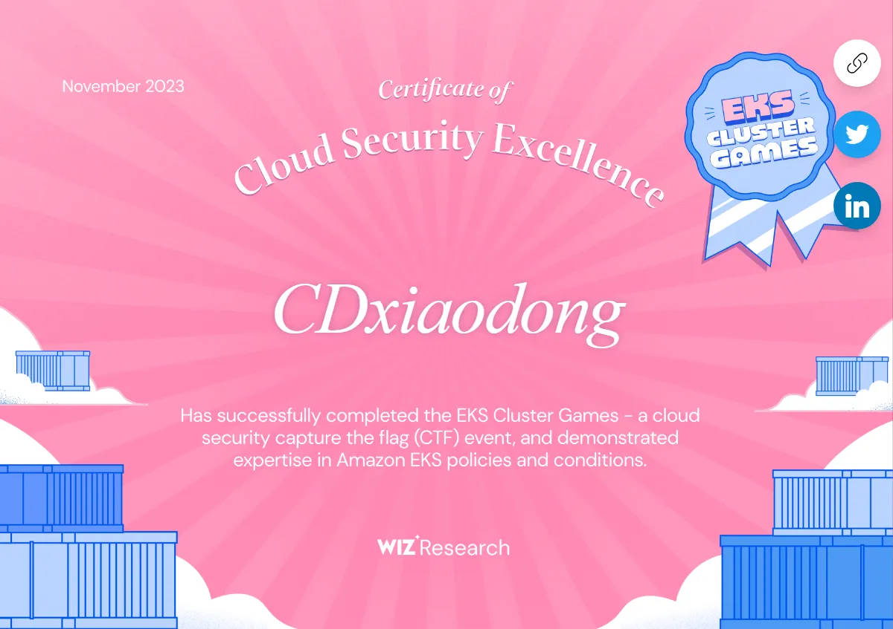

<!--   my-icons -->

    
    
    
    
    
       

<!--   my-ticker -->    

<!--   my-kaggle     
### My achievements on [kaggle]():

-->

<!--   my-skils -->

| Property                                        | Data                                                                                                                                                                                                                                                                                                                                                                                                                                                                                                                                                                                                                                                                                                                                                                                                                                                                                                                                                                                                                                                                                                                                                                                                                                                                                                                                                                                                                                                                                                                                                                                                                                                                                                                                                                                                            |
|-------------------------------------------------|-----------------------------------------------------------------------------------------------------------------------------------------------------------------------------------------------------------------------------------------------------------------------------------------------------------------------------------------------------------------------------------------------------------------------------------------------------------------------------------------------------------------------------------------------------------------------------------------------------------------------------------------------------------------------------------------------------------------------------------------------------------------------------------------------------------------------------------------------------------------------------------------------------------------------------------------------------------------------------------------------------------------------------------------------------------------------------------------------------------------------------------------------------------------------------------------------------------------------------------------------------------------------------------------------------------------------------------------------------------------------------------------------------------------------------------------------------------------------------------------------------------------------------------------------------------------------------------------------------------------------------------------------------------------------------------------------------------------------------------------------------------------------------------------------------------------|
| **Language / IDE**                              |                                                                                                                                                                                                                                                                                                                                                                                                                                                                                                                                                                                                                                                                                                                                                                                                                                                                                                                                                                                                                                                                                                                                                                                                                                                                                                                                                                                                                                                                                               |
| **Domain Knownledge**                           |                                                                                                                                                                                                                                                                                                                                                                                                                                                                                                                                                                                                                                                                                                                                                                                                                                                                                                                                                                                                                                                                                          |
| **CI / CD**                                     |                                                                                                                                                                                                                                                                                                                                                                                                                                                                                                                                                                                                                                                                                                                                                                                                                                                                                                                                                                                                                                                                                                                                                                                                                                                                                                                                                                                          |                                                                                                                                                                                                                                                                                                                                                                                                                                                                                                                                                                                                                                                                                                                                                                                                                                                                                                                                                                                                                                                                                                                                                                                                                                                                                                                                                                                                                                                                                                                                                                                                                                                             |
| **Machine Learning / Deep Learning frameworks** | ![Jupyter Notebook](http://img.shields.io/badge/-Jupyter%20Notebook-eee?style=flat-square&logo=data:image/png;base64,iVBORw0KGgoAAAANSUhEUgAAAA4AAAAQCAMAAAARSr4IAAACGVBMVEVhYmJdYWT/fBfzdyaqdlV2dnfcdC9udnz5dyKUaU3wdicCO2CzZzVdUkpOTk5MTk60ZzUAAP/XcC3fcivgciv/lArAajLqdSifYjrydyajnJjEjWifnp3FjGcAAACenp52dnd2dnd2dndhYmJhYmIxW3bzdybzdybzdybzdybzdyb/dxpydnl2dnd2dndhYmJgYmOda0r0dyXzdybzdybzdybudymQdmZldoJQYGmRaU7ydyfzdybzdybzdybzdybzdybzdybzdyb1dyX9dx/2dyXzdybzdybzdyb+eiPzdybzdybzdyb/ghz8eSQ3SFT/tABNTk5HTFBMTk5OTk5OTk5OTk5OTk5OTk5OTk5OTk5OTk5NTk5GTFBOTk5OTk5OTk5OTk5OTk5OTk5OTk5OTk5OTk5OTk5OTk5OTk5OTk5OTk5OTk5NTk5OTk5OTk5OTk5OTk5OTk5OTk5OTk5OTk5NTk5NTk5UUEx5WUMAOGRMTU9OTk5OTk5OTk5OTk5OTk5FTFAXQFvBajK8aTP2eCX0dyb0dyb0dybzdyb4eCXzdybzdybzdybzdybzdybzdybzdybzdybzdyb6dB3zdyXzdybzdybzdybzdybzdybzdybzdyaenp6cn6HKimD0dyXzdybzdybzdybzdybzdybzdyaenp6enp6dn6Dzdybzdyaenp6enp6enp6enp7zdyaenp7///9F1GYlAAAAsHRSTlMAAAAAAAAAAAAAAAAAAAAAAAAAAAAAAAAAAAAAAAAAADHCVho4Ax1RcnFOFz/ibFmwHXPc/thwKwkKJpfbqn1oaX+uighRdSIDAyV6TAQcAgIVHBMbKjIgEzBTHCsbLUBdQlhiTWBlR1xkaEVIR1tPbFEvF0pJNR9AFAQIMwgfKQUDBwgDBEsuMkcCLLSUKBsqT5iwNcX47N/g7cAxPmUqZq/OzaxiExPJYgQPCJjcP9lVnrgAAAClSURBVAjXVcyxSoIBAEXh+xkhEkFr6hD0AM5BkbQ3ODaEY4uDSENCS1BThI/h4v4TERG0NzZHvoAQ0SDV8FvkmS6cw5UgSTR5s83rlgUvWuA8l/Bs59eYbXhS28VdUt1H4dA9Eu1HexUdS3T/7Y81vXJ9rQicLcxoAK64hvd1fWwOeDgoy+JW3bCs56tOonnxd3ycGKt9nt7I91GShgn60yRJI/kBP8EfEEdOa6sAAAAASUVORK5CYII=&logoColor=F37626)    |
                                                                                                                    

<h5 style="text-align:center">EKSClusterGame</h5>

<h5 style="text-align:center">K8s-Lan-Party</h5>

Now I am committed to cloud security and container security research 

## - Vulnerabilities (CVE/SRC)
- CNVD-C-2022-369640
- CNVD-2022-498774 
- CNVD-2022-51701 
- CNVD-C-2023-73489
- CNNVD-2023/2024 and more than a dozen.
- src on cloud-sercurity is going on.
## - Articles You never want miss（Arrange according to time, Some articles require a password. Contact me to get it ）
Fishing Technique Report : 
- https://cdxiaodong.github.io/%E9%92%93%E9%B1%BC%E6%89%8B%E6%B3%95%E6%8A%A5%E5%91%8A-CD.html
Web Penetration and Code Audit Articles : 
- https://cdxiaodong.github.io/java%E4%BB%A3%E7%A0%81%E5%AE%A1%E8%AE%A1%E5%85%A5%E9%97%A8.html
- https://cdxiaodong.github.io/%E6%98%8E%E6%BA%90%E4%BA%91.html
- https://cdxiaodong.github.io/java%E4%BB%A3%E7%A0%81%E5%AE%A1%E8%AE%A1%E5%B0%8Ftips.html
- https://cdxiaodong.github.io/ysos%E5%88%A9%E7%94%A8nc%E5%8F%8D%E5%BA%8F%E5%88%97%E5%8C%96.html
- https://cdxiaodong.github.io/java%E4%BB%A3%E7%A0%81%E5%AE%A1%E8%AE%A1-rce%E7%AC%AC%E4%B8%80%E6%AD%A5-%E5%BF%AB%E9%80%9F4%E5%B1%82%E6%8E%A2%E7%B4%A2%E6%9C%AA%E6%8E%88%E6%9D%83.html
- https://cdxiaodong.github.io/java%E5%BF%AB%E9%80%9Frce%E4%B9%8B%E6%89%B9%E9%87%8F%E5%8F%8D%E7%BC%96%E8%AF%91%E5%90%8E%E4%B9%8B%E4%B8%89%E7%BA%BF%E5%B9%B6%E8%A1%8C(%E4%BD%BF%E6%95%88%E7%8E%87%E6%8B%89%E6%BB%A1)%E6%89%BE%E6%B4%9E.html
- https://cdxiaodong.life/article/17-java-vluns
- https://cdxiaodong.life/article/java9-self-attch

AD and Intranet penetration :
- https://cdxiaodong.github.io/%E4%BB%8E%E5%A4%96%E7%BD%91%20Weblogic%20%E6%89%93%E8%BF%9B%E5%86%85%E7%BD%91%EF%BC%8C%E5%86%8D%E5%88%B0%E7%BA%A6%E6%9D%9F%E5%A7%94%E6%B4%BE%E6%8E%A5%E7%AE%A1%E5%9F%9F%E6%8E%A7205359.html

Programming Development Notes :
- https://cdxiaodong.github.io/phpwebshell%E4%BB%8E%E5%9F%BA%E7%A1%80%E5%88%B0%E6%B7%B1%E5%85%A5%E5%8F%98%E7%A7%8D.html
- https://cdxiaodong.github.io/turated%E5%85%B3%E6%8E%89windowsdefance.html
- https://cdxiaodong.github.io/%E5%88%B6%E4%BD%9Ctwitter%E7%88%AC%E8%99%AB.html
- https://cdxiaodong.github.io/shell%20%E7%BC%96%E7%A8%8B%E5%BC%80%E5%8F%91.html
- https://cdxiaodong.github.io/nps%E9%BB%98%E8%AE%A4%E8%B4%A6%E5%8F%B7%E5%AF%86%E7%A0%81%E7%88%86%E7%A0%B41w%E5%A4%9A%E4%B8%AAurls.html
- https://cdxiaodong.github.io/java%E5%8F%8D%E5%BA%8F%E5%88%97%E5%8C%96%E6%AD%A6%E5%99%A8%E5%8C%96%E5%88%B6%E4%BD%9C.html

Binary development Articles：
- https://cdxiaodong.github.io/%E5%86%99%E4%B8%AA%E5%A3%B3.html
- https://cdxiaodong.github.io/%E5%86%85%E5%AD%98%E8%AE%BF%E9%97%AE%E5%BC%82%E5%B8%B8hook.html
- https://cdxiaodong.github.io/vt%E5%85%A8%E5%85%8D%E6%9D%80%E5%8A%A0%E8%BD%BD%E5%99%A8.html

security research ：
- https://cdxiaodong.github.io/%E5%AE%9E%E7%8E%B0%E4%BB%BB%E6%84%8F%E6%96%87%E4%BB%B6%E9%9D%99%E9%BB%98%E5%AE%89%E8%A3%85%E7%A0%94%E7%A9%B6.html
- Rasp confrontation :https://cdxiaodong.life/article/RASP-Attack_and_Defence

Deep learning :
- https://cdxiaodong.life/article/Application_and_comparison_of_different_deep_learning_methods_in_data_feature_extraction

cloud-sercurity and container-security:
- https://cdxiaodong.life/article/Kubernetes-Goat
- https://cdxiaodong.life/article/CVE-2024-21626
- https://cdxiaodong.life/article/ebpf_in_docker
- https://cdxiaodong.life/article/Solution_on_Container_Security_Verification_based_on_EBPF
- https://cdxiaodong.life/article/BASonCLOUD
- https://cdxiaodong.life/article/Network_isolation_in_K8s_Security

office efficiency :
- https://cdxiaodong.life/article/notion_or_feishu
- https://cdxiaodong.life/article/favorite-article

## -  Get to know me from the saas front-end I host
- [多维度云原生ATT&CK视角](https://cloud-matrix.cdxiaodong.life/)
- [7条top云攻击路径](https://top-7-attack-paths.cdxiaodong.life/)
- [favorite-article-real-time ](https://favorite-article.cdxiaodong.life/)

## - I'm also write some codes ;)
red-team:
- https://github.com/cdxiaodong/-selenium-nps-
- https://github.com/cdxiaodong/-shell-
- https://github.com/cdxiaodong/NCuploadServletRCE
- https://github.com/cdxiaodong/Apt_t00ls
- https://github.com/cdxiaodong/Transacted-Hollowing-allinone
- https://github.com/cdxiaodong/ASM-hide-RASP

cloud-sercurity:
- https://github.com/cdxiaodong/ebpf-c-tample-action
- https://github.com/cdxiaodong/k8s-2024-21626
- https://github.com/cdxiaodong/docker-for-Verification

chrome plugin:
- https://github.com/cdxiaodong/Site-Specific-Extension-Manager
office efficiency :
- https://github.com/cdxiaodong/windows-internals-7th-Chinese-
- https://github.com/cdxiaodong/-Docker-

### - POC Based
- https://github.com/cdxiaodong/CVE-2021-4034-touch
- https://github.com/cdxiaodong/CVE-2024-21626
- 20 container secure CVE images

### Profile Views
This github account was created on September 12, 2020
counting of visitors to this page in this section started from September 12, 2023
#### Thanks for visiting :heart:

 
  

[MIT](LICENSE)

contact me : cdxiaodong@systemshell.org
